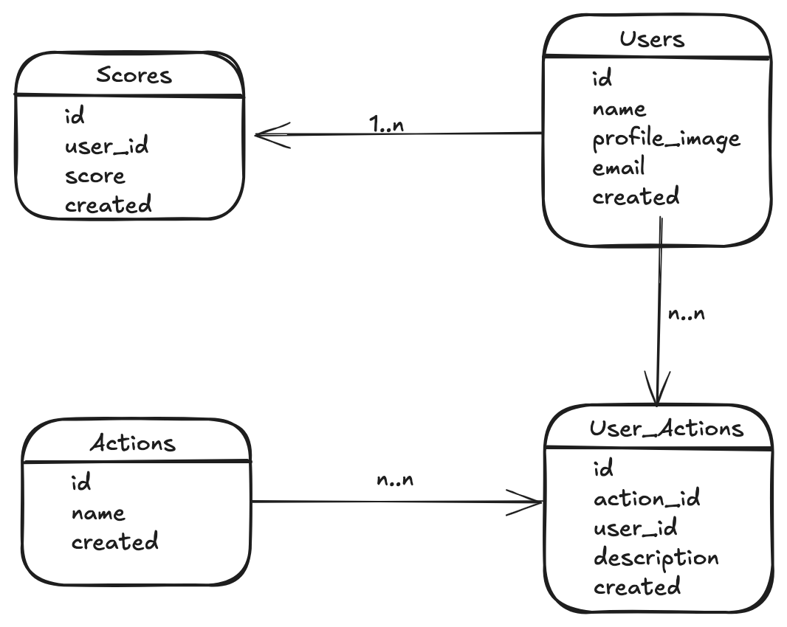
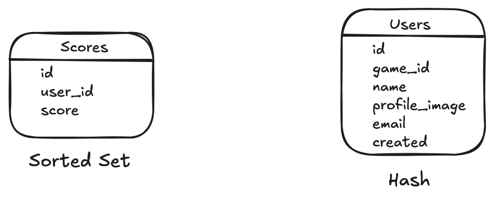
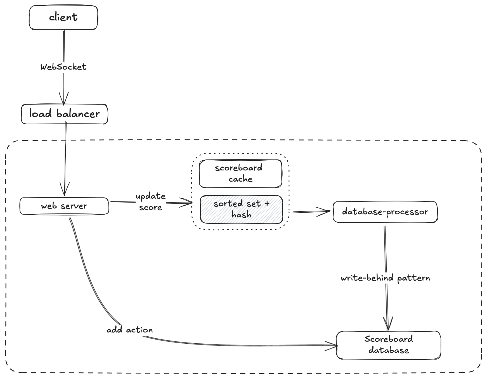
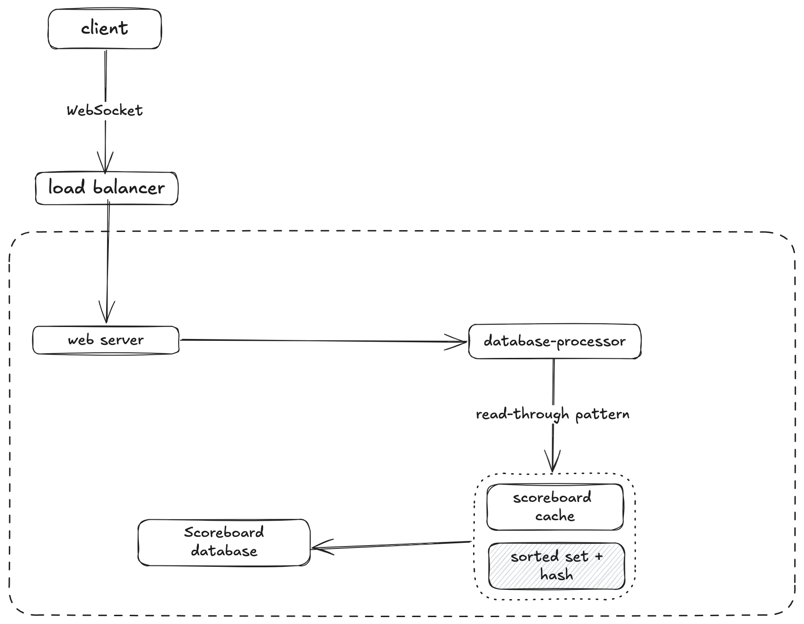

# Live Scoreboard API Module Specification

## Software Requirements

1. We have a website with a score board, which shows the top 10 user’s scores.
2. We want live update of the score board.
3. User can do an action (which we do not need to care what the action is), completing this action will increase the user’s score.
4. Upon completion the action will dispatch an API call to the application server to update the score.
5. We want to prevent malicious users from increasing scores without authorisation.

## Features

1. **Real-Time Updates**: Utilizes WebSocket or Server-Sent Events (SSE) to update the scoreboard dynamically.
2. **Score Update Endpoint**: An authenticated API endpoint to increment user scores.
3. **Security**: Measures to prevent unauthorized score updates.
4. **Persistence**: Store and retrieve scores efficiently.

## Functional Requirements

1. The system must allow users to securely update their scores via an API endpoint.
2. The scoreboard must display the top 10 user scores in real-time.
3. All API requests to update scores must be authenticated.
4. The system must validate all inputs for score updates to prevent invalid or malicious data.
5. The top 10 scores must be retrievable via a dedicated API endpoint.
6. Logs must be maintained for all score update activities for auditing purposes.

## Non-Functional Requirements

1. High availability
2. Low latency
3. Scalability
4. Reliability
5. Minimal operational overhead

## API Endpoints

### 1. `POST /api/action/perform`

#### Description

Perform a valid action of user.

#### Request

- **Headers**:
  - `Authorization`: Authorize your user account
  - `content-encoding`: type of data format (JSON)
- **Body** (JSON):
  ```json
  {
    "userId": "string",
    "actionId": "string",
    "description": "string"
  }
  ```

#### Response

- **200 OK**
  ```json
  {
    "success": true,
    "message": "Action performed successfully."
  }
  ```
- **400 Bad Request**
  ```json
  {
    "success": false,
    "message": "error_info"
  }
  ```

### 2. `GET /api/score/top`

#### Description

Fetches the top 10 user scores for the scoreboard.

#### Request

- **Headers**: None required

#### Response

- **200 OK**
  ```json
  {
    "success": true,
    "topScores": [
      { "userId": "user1", "score": 150 },
      { "userId": "user2", "score": 140 },
      { "userId": "user3", "score": 135 }
    ]
  }
  ```
- **500 Internal Server Error**
  ```json
  {
    "success": false,
    "message": "An error occurred while fetching scores."
  }
  ```

## ScoreBoard data storage

### ScoreBoard database schema design



The major entities of the relational database are the Users table, the Actions table, the User_Actions table, and the Scores table



The major entities of the in-memory database (Redis) are Scores and Users. The sorted sets data type in Redis is used to store the Scores and the hash data type in Redis is used to store the metadata of the Users

### Scoreboard high-level design

### Flow update score (add action)



1. The client creates a WebSocket connection to the load balancer for real-time communication
2. The load balancer delegates the client’s request to the closest data center
3. The server updates the score on the sorted set data type in Redis when action valid.
4. The database-processor function updates the records on the relational database using the write-behind cache pattern

### Retrieve the scoreboard data



1. The client creates a WebSocket connection to the load balancer for real-time communication
2. The load balancer delegates the client’s request to the closest data center
3. The database-processor invokes the sorted set data type in Redis
4. The database-processor queries the relational database on a cache miss using the read-through cache pattern


## Security Measures

- **Action Token Verification**:
  - The `Authorization` must be signed and verified using a secure method (e.g., JWT or HMAC).
  - Tokens will include user identification, timestamp, and a signature.
- **Rate Limiting**:
  - Implement rate-limiting to prevent excessive requests from a single user.
- **Input Validation**:
  - Validate `userId` and `Authorization` formats to avoid injection attacks.